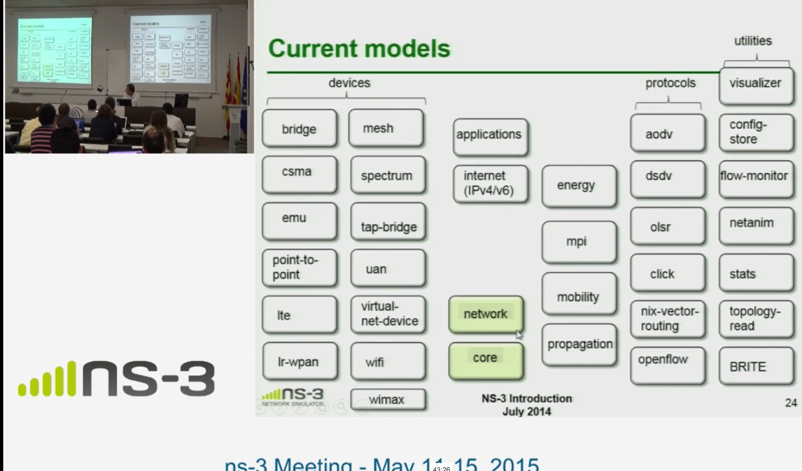
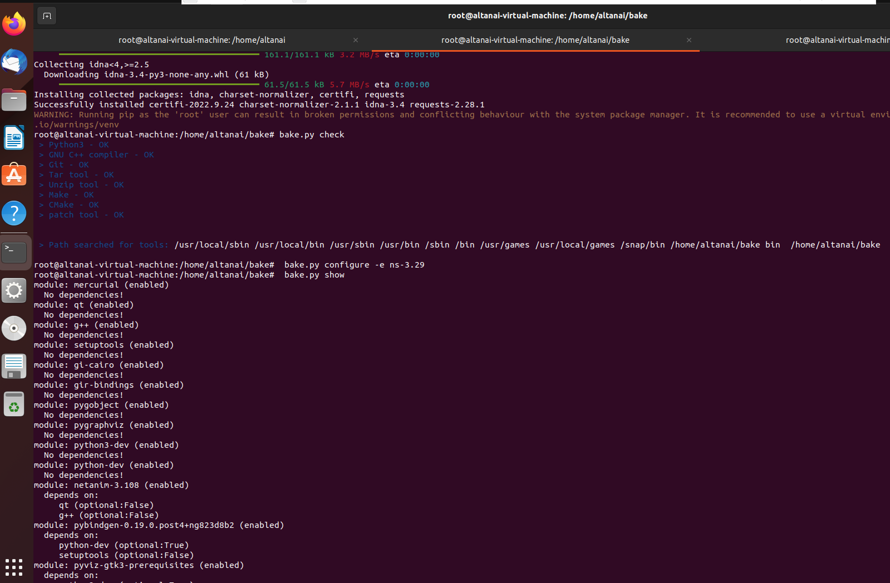
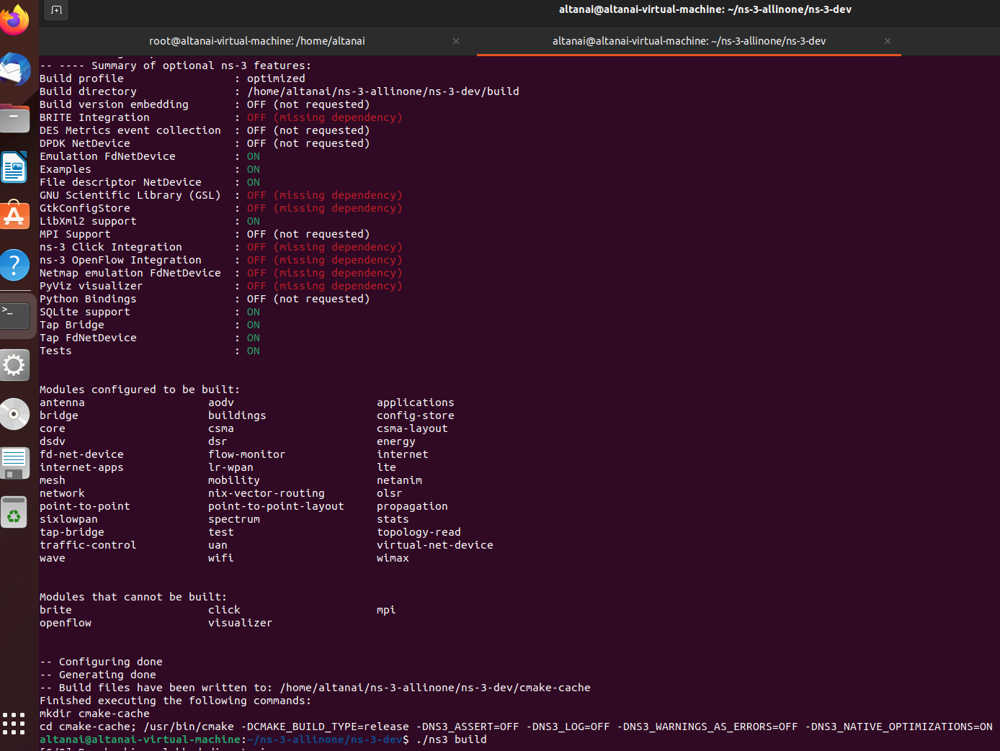

# Networking protocols 

## DHCP

## ARP
 
## DNS

# Network simulation ns3

## Downloading and building ns3 using bake 

    git clone https://gitlab.com/nsnam/bake

Add bake to your path.

    export BAKE_HOME=`pwd`/bake 
    export PATH=$PATH:$BAKE_HOME
    export PYTHONPATH=$PYTHONPATH:$BAKE_HOME

bake check:

    bake.py check

configure bake for module to be aded to ns-3

    bake.py configure -e ns-3.29

List added modules with their specific system requirements 

    bake.py show   

To download the modules, build and install you can call bake deploy

    bake.py deploy

## ns-3-allinone

 git clone https://gitlab.com/nsnam/ns-3-allinone.git

Download the latest 

    > ./download.py

        #
        # Get NS-3
        #
        
    Cloning ns-3 development repository
    =>  git clone https://gitlab.com/nsnam/ns-3-dev.git
    Cloning into 'ns-3-dev'...
    remote: Enumerating objects: 185394, done.
    remote: Counting objects: 100% (1198/1198), done.
    remote: Compressing objects: 100% (595/595), done.
    remote: Total 185394 (delta 608), reused 1163 (delta 594), pack-reused 184196
    Receiving objects: 100% (185394/185394), 156.68 MiB | 23.86 MiB/s, done.
    Resolving deltas: 100% (154799/154799), done.

        #
        # Get NetAnim
        #
        
    Retrieving NetAnim from https://gitlab.com/nsnam/netanim.git
    =>  git clone https://gitlab.com/nsnam/netanim.git netanim
    Cloning into 'netanim'...
    remote: Enumerating objects: 2173, done.
    remote: Total 2173 (delta 0), reused 0 (delta 0), pack-reused 2173
    Receiving objects: 100% (2173/2173), 12.97 MiB | 12.03 MiB/s, done.
    Resolving deltas: 100% (1325/1325), done.

        #
        # Get bake
        #
        
    Retrieving bake from https://gitlab.com/nsnam/bake.git
    =>  git clone https://gitlab.com/nsnam/bake.git
    Cloning into 'bake'...
    remote: Enumerating objects: 2290, done.
    remote: Counting objects: 100% (176/176), done.
    remote: Compressing objects: 100% (110/110), done.
    remote: Total 2290 (delta 108), reused 109 (delta 66), pack-reused 2114
    Receiving objects: 100% (2290/2290), 2.78 MiB | 9.92 MiB/s, done.
    Resolving deltas: 100% (1538/1538), done.

Build 

    > ./build.py

or 

    > ./build.py --enable-examples --enable-tests

Test 

    > ./test.py --no-build
    [1/5] PASS: Example src/core/examples/main-callback
    [2/5] PASS: Example src/core/examples/sample-simulator
    [3/5] PASS: Example src/core/examples/main-ptr
    [4/5] PASS: Example src/core/examples/sample-random-variable
    [5/5] PASS: Example src/core/examples/test-string-value-formatting
    5 of 5 tests passed (5 passed, 0 skipped, 0 failed, 0 crashed, 0 valgrind errors)

cd  ns-3-dev

    ./ns3 configure --build-profile=optimized --enable-examples --enable-tests

    ./ns3 build
    ./ns3 show profile

Help

    ./ns3 --help

Show fversion 

    > ./ns3 show version
    ns-3 version: ns-3.37-113-gd382197be-dirty
    Reconfigure with './ns3 configure --enable-build-version' to bake the version into the libraries.

### Configuration with Waf

    
    CXXFLAGS="-O3" ./waf configure 

## Run scripts

    ./ns3 run "scratch/first.cc" --no-build

Ref:

- https://www.nsnam.org/docs/release/3.37/tutorial/html/tweaking.html
- Code https://code.nsnam.org/
- examples ns3 https://www.nsnam.org/docs/release/3.19/doxygen/first_8cc_source.html
- video https://vimeo.com/showcase/3480129